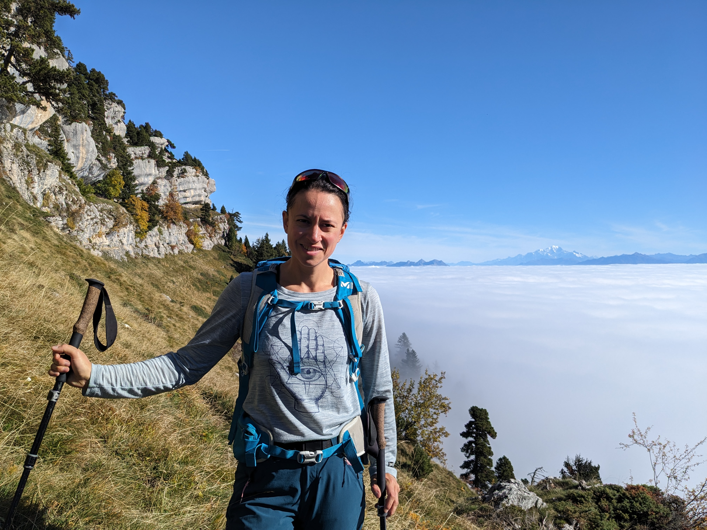

+++
date = 2024-02-02T04:14:54-08:00
draft = false
title = 'Faustine Geromel - Accompagnatrice en montagne'
weight = 10
[params]
  author = 'Faustine'
+++

  

Je cotoie les montagnes et la marche depuis l'enfance, alors que mes parents m'emmenaient randonner pendant les vacances. Plus tard, j'ai découvert la magie de l'itinérance et des bivouacs. En 2022, je m'installe à Grenoble et me lance dans l'aventure de l'accompagnement en montagne.

Je mène cette activité en parallèle d'un emploi salarié en tant qu'ingénieure dans le bâtiment, spécialiste de la rénovation énergétique. Ces deux activités sont pour moi profondément complémentaires : en tant qu'ingénieure, je souhaite contribuer à un futur plus respectueux de notre environnement. La montagne, en ne cessant de m'émerveiller, me rappelle pourquoi je mobilise mon énergie au quotidien pour préserver les milieux naturels dans lesquels nous vivons.

Cet émerveillement, je le ressens à toutes les échelles : depuis la fleur que j'observe à la loupe, jusqu'à l'immensité des paysages et au déchaînement des éléments, en passant par la rencontre inattendue avec un animal ou l'ambiance particulière d'une forêt brumeuse.
Si j'emmène des personnes en montagne, c'est pour transmettre et partager cet amour et cette curiosité de ce qui nous entoure !

Accompagnatrice en montagne en devenir (bientôt titulaire si tout se passe bien ! je dispose des prérogatives pour encadrer depuis 2023), je vous accompagne en toute sécurité, lors de sorties à la journée ou demi-journée (sorties thématiques notamment), ou bien lors de randonnées itinérantes sur plusieurs jours, autour de Grenoble ou ailleurs dans les Alpes.

Je suis formée à la communication non violente : la bienveillance, l'écoute et l'attention font partie de mes valeurs. Limiter mon impact en allant en montagne me tient également à coeur : dans la mesure du possible, je propose des sorties accessibles en transports en commun ; lorsque ce n'est pas le cas, privilégions le covoiturage au maximum.

Hâte de vous retrouver sur les sentiers !

  

